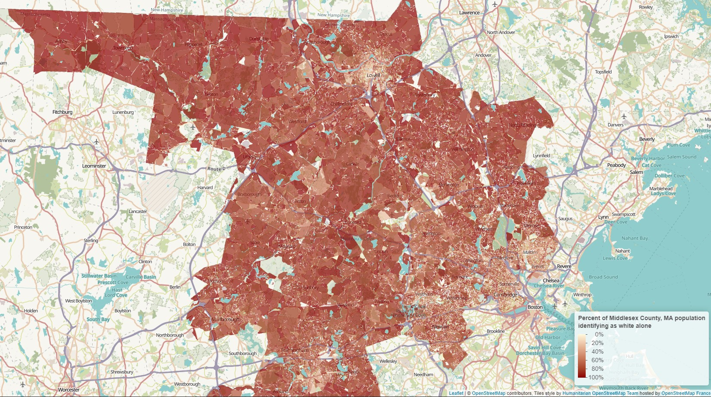
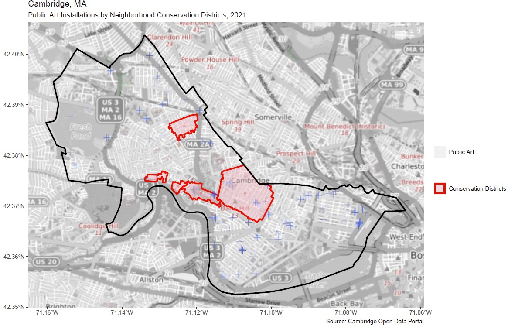
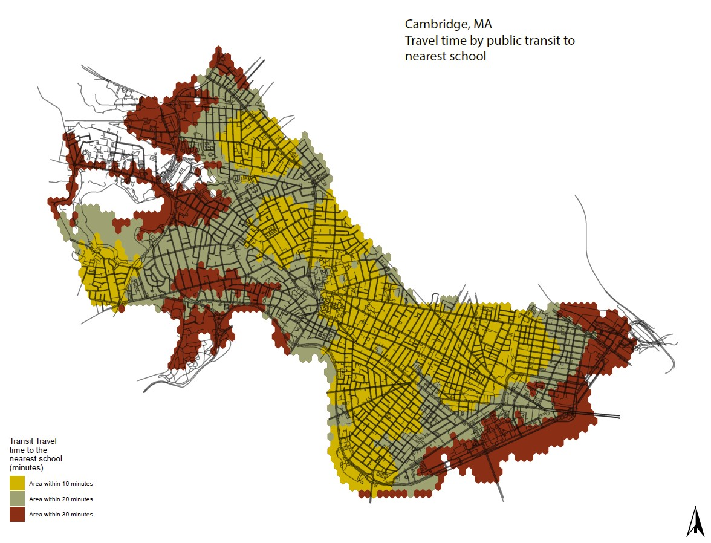
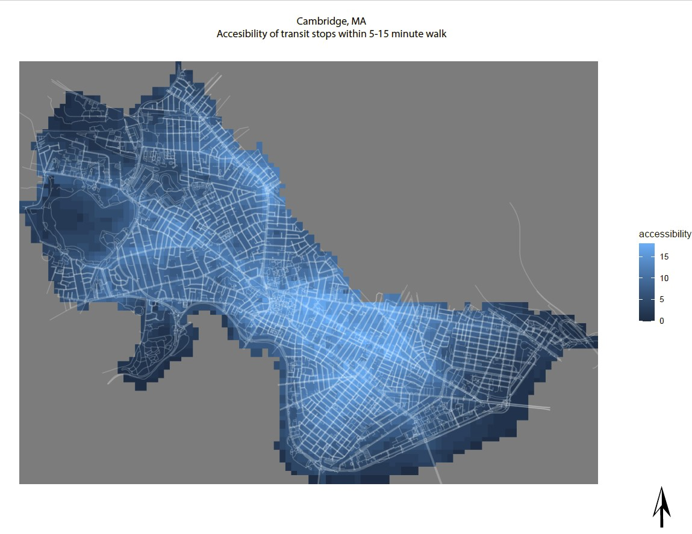
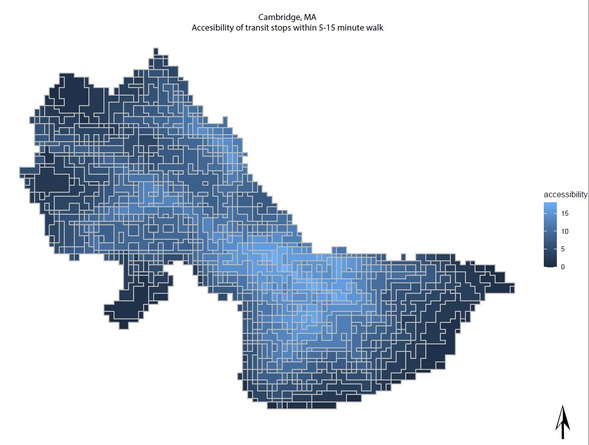
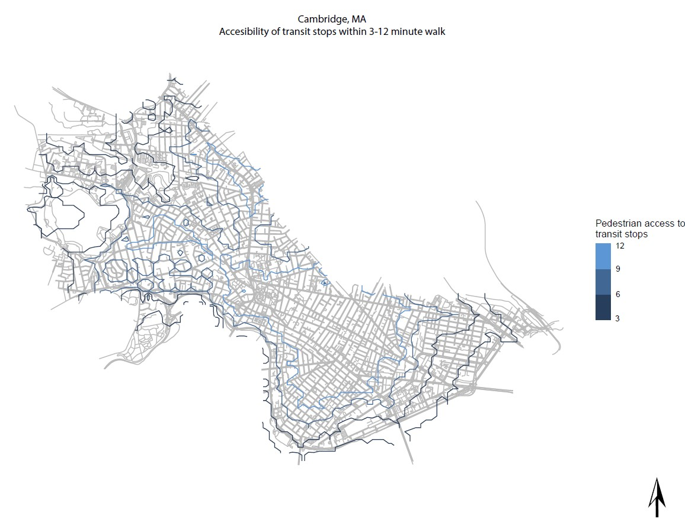
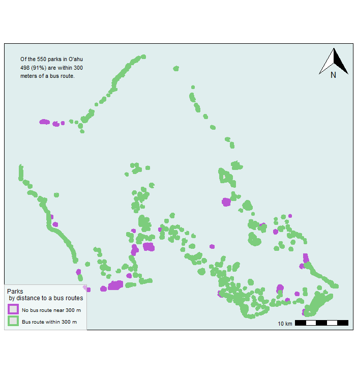
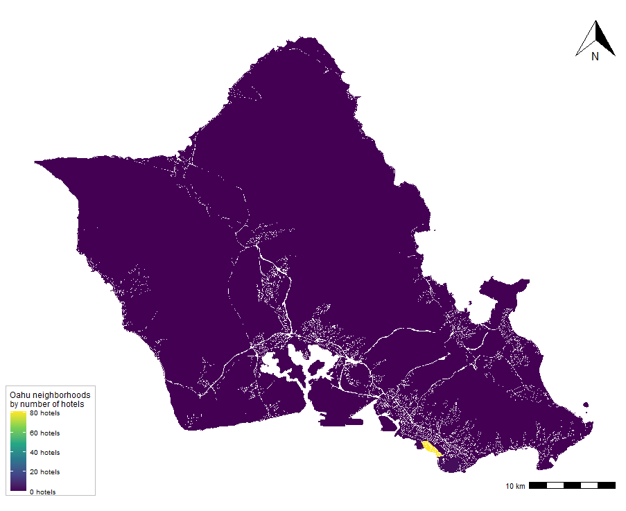

```{r setup, include=FALSE}
knitr::opts_chunk$set(echo = TRUE)
```

# Introduction

Throughout the course of the semester, my skills and confidence in developing maps grew. I went from never having opened an R session, to actually enjoying learning through the tutorials, troubleshooting, and creating maps that spatially represent key concepts learned in the readings and lectures. This semester has shown me what deep reverence I hold for R. It is amazing that a computer program can evoke such emotional volatility: The frustration over hitting a wall, and needing to find a workaround. The anxiety and anticipation watching the red stop sign as a code runs. Best of all, the pure joy when that code chunk runs and you have created a map you can call your own. I have also learned the importance of collaborative work, and the fun in the challenge of working through problems as a team. While this portfolio is a synthesis of what I have learned this semester, it provided me the opportunity to reflect on and be proud of how far I have come in just six weeks.

I believe my portfolio demonstrates each of the following skills:

* Displaying multiple vector layers on the same map
* Calculating and displaying relationships among point and polygon layers based on distance
* Aggregating point data to a layer of polygons
* Calculating and displaying accessibility, based on travel time
* Converting between raster layers and vector layers
* Displaying raster data on a map
* Georeferencing a raster image
* Displaying data on an interactive map


## About the Mapper

Ellie Sheild, a native of North Carolina, is a first-year Master in Urban Planning Student at Harvard University's Graduate School of Design. When not prematurely graying her hair from R coding, she enjoys hiking, biking, and exploring the greater Boston area. 


### Contact

Ellie Sheild (She/Her/Hers)
Master in Urban Planning Candidate 2023
Email: esheild@gsd.harvard.edu
Phone: 704-441-4076 

## Ackowledgements

I would like to give credit to Professor Carole Voulgaris, Teaching Fellow Charu Srivastava, the Teaching Assistant Dream Team (Emma, Megan, and Jonathan), and my fellow MUP students. Thank you for taking the time to help me grow this semester, and I hope you all enjoy my VIS2128 portfolio.


# Mumbai, India

Rob Kitchen's et al., research "Thinking about Maps" discusses the implications of map making and cartography on the expansion of colonialism. The impacts of colonialism are evidenced in changing geographic boundaries over time of jurisdictions. My focus for this particular project was Mumbai, India, which was occupied by the British empire from 1858-1947.

## Administrative Boundaries 

Administrative Boundaries demonstrates the differences in relation to a map created by the British at the height of their rule in 1900 to a precolonial boundary of 1849 (blue) and jurisdictional growth over time during the rule of 1931 (red). 

This map demonstrates the following skills:
* Displaying raster data on a map
* Georeferencing a raster image

[](https://esheild.github.io/E_Sheild_Portfolio/fullsize/Mumbai_final.pdf){target="_blank"}

# Middlesex County, MA

Having just moved to Massachusetts, I was eager to pull census data to better understand the spatial segregation within my new community. Acklowedging the biases in my own data and processes, I decided for my individual assignment to focus on the percent of White-identifying individuals from the 2010 Census within Middlesex County. My goal in the interactive map is to guide the viewer towards trends of segregated areas. I hope to continue to develop this map by overlaying more point data for public resources, like libraries, schools, and parks, in hopes to visually demonstrate how resources are dispersed in relation to the race of the area. I hope any observed disparities will foster critical thinking in ways we can better integrate and diversify our communities. I also intend to show this map with friends living in Middlesex and compare reactions with my family in North Carolina to observe any spatial optimism bias (Retchless) in the racial segregation of Middlesex County, MA.

## Interactive Map
This interactive map demonstrates the following skills: 

* Displaying data on an interactive map

[](https://esheild.github.io/E_Sheild_Portfolio/fullsize/Middlesex_white.html){target="_blank"}


# Cambridge, MA

## Public Art Installations

This map highlights a possible relationship between identified conservation districts (pink polygon) and public art installations as point data (blue). 

This map demonstrates the following skills:

* Displaying multiple vector layers on the same map
* Aggregating point data to a layer of polygons

[](https://esheild.github.io/E_Sheild_Portfolio/fullsize/Cambridge_Art_Nhood.pdf){target="_blank"}

## Travel time to school

Inspired by my own 2.5 mile commute either on bus or bike to school, I wanted to map the commuting experiences of other students in Cambridge. This isochrone map, depicting an area accesible from a point within a certain time threshold, is based on transit travel times to the nearest school. 

This map demonstrates the following skills:

* Displaying multiple vector layers on the same map
* Calculating and displaying accessibility, based on travel time

[](https://esheild.github.io/E_Sheild_Portfolio/fullsize/Cambridge_schools_1_final.pdf){target="_blank"}

## Accessibility

Furthering the work in the above map, I worked using the distance-decay function to identify the accessibility of transit stops throughout Cambridge within a 5, 10, and 15 minute walk from any given point in that isochrone. 

This map demonstrates the following skills:

* Displaying multiple vector layers on the same map
* Calculating and displaying accessibility, based on travel time
* Displaying raster data on a map

[](https://esheild.github.io/E_Sheild_Portfolio/fullsize/Cambridge_walk_final.pdf){target="_blank"}

## Polygon Mapping

In the below map, I transformed a map of the transit stops as grid cells to polygons on a square grid. To make the map easier to read, I combined adjacent areas with the same value as a merged single polygon. The following map shows accessibility of transit stops within a 0-15 minute walk.

* Displaying multiple vector layers on the same map
* Calculating and displaying accessibility, based on travel time
* Converting between raster layers and vector layers
* Displaying raster data on a map

[](https://esheild.github.io/E_Sheild_Portfolio/fullsize/CAM_polygons_cells_final.pdf){target="_blank"}

## Contour Mapping

Having always admired contour lines on topographic maps, I continued to pull polygons from grid cells and then have the polygon boundaries appear as contours. The following map shows the pedestrian access to the number of transit stops (increments of 3) overlaid on the street network in Cambridge, MA. 

* Displaying multiple vector layers on the same map
* Calculating and displaying accessibility, based on travel time
* Converting between raster layers and vector layers
* Displaying raster data on a map

[](https://esheild.github.io/E_Sheild_Portfolio/fullsize/CAM_contours_final.pdf){target="_blank"}


# O'ahu, Hawaii

Reflecting from other course readings on the implications of United States imperialism, I learned of Hawaii's forced state-hood in 1959 against the will of many indigenous people. The rapid encroachment of tourism on the state in the 1960s, and its threat to the sugar and pineapple agricultural industries and negative environmental impacts, led me to assess the infrastructure within Hawaii's largest island of O'ahu. Only two-years after statehood, Hawaii was one of the first state's to introduce state-wide land use growth management, of which only allocated 4% of their total land was classified as Urban areas as a result of the aforementioned impacts.
 
## Infastructure and Amenities

This map highlights infrastructure of bus routes on the island of O'ahu in relation to public parks. Of the 550 parks on O'ahu, 91% of those parks fall within 300 m of a bus route. 

This map demonstrates the following skills:

* Displaying multiple vector layers on the same map

* Calculating and displaying relationships among point and polygon layers based on distance

[](https://esheild.github.io/E_Sheild_Portfolio/fullsize/Oahu_1.pdf){target="_blank"}

## Concentration of Urban Tourism

The below move highlights the land use impacts of a limited 4% of the state's land area as urban areas. Exploring the neighborhoods on O'ahu, it is clear that most neighborhoods on the island have between 0-10 hotels, in contrast to the urban area of Honolulu boasting over 80 hotels. 

This map demonstrates the following skills:

* Displaying multiple vector layers on the same map

* Calculating and displaying relationships among point and polygon layers based on distance

[](https://esheild.github.io/E_Sheild_Portfolio/fullsize/Oahu_hotels_final.pdf){target="_blank"}


